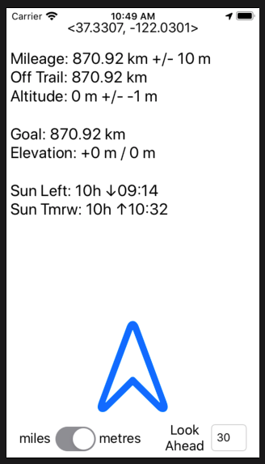

A simple text-based tracking app for iOS to bring on hikes and bikes that gives you all the info you need and nothing more.



## Features
- your current lat, lon
- distance along gpx track
- off trail warning and visual guidance back to trail
- current elevation
- distance to goal
- elevation gain and loss to goal
- sunrise and sunet times
- switch between metric and imperial units
- change goal distance

## Usage
You need to prepare you gpx data into a specific format for this app and then replace the contents `bruce_all.txt` with your precomputed data.
The file format is as follows:
```swift
tracks = [[<LAT>, <LON>, <ELEVATION>, <DISTANCE_FROM_START>], [...], ...];
poi = [[<LAT>, <LON>, <ELEVATION>, <DISTANCE_FROM_START>, <HEADER_TEXT>, <MAIN_TEXT>, <MORE_TEXT>], [...], ...];
```
So essentially there are two 2-dimensional lists (tracks and poi) containing data which will be parsed and each list is separated by a `;`

The type for the elements in these lists is as follows (extracted from the code):
```swift
var tracks: [[Double]] = [];
var poi: [(Double, Double, Double, Double, String, String, String)] = [];
```

Please refer to the `bruce_all.txt` file already present in the project for a real example.
